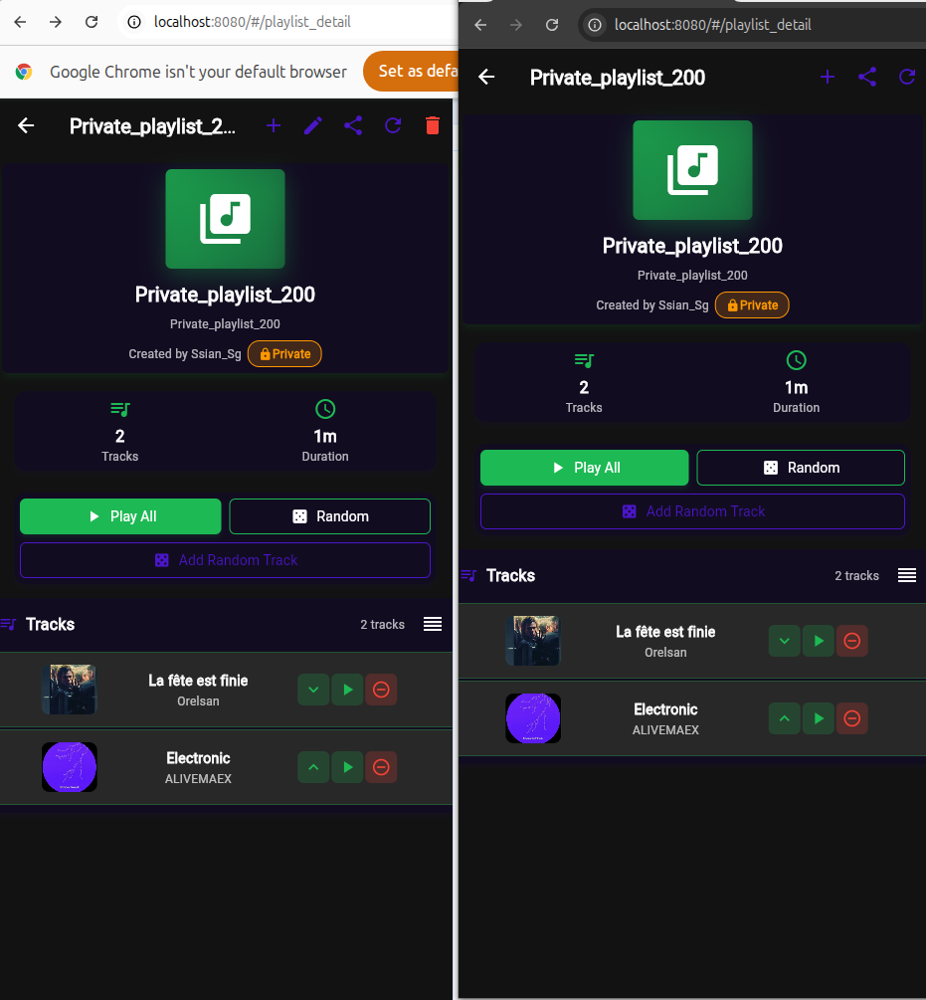

# Music Room

## Features & Screenshots

### 1. Home Screen & Navigation

The home screen serves as the main hub of the application, featuring:
- **App Title**: "Music Room" prominently displayed
- **Tagline**: "Discover, create, and share your favorite playlists"
- **Quick Actions**:
  - Create Playlist button (green plus icon)
  - Search Music button (magnifying glass icon)
- **Your Playlists Section**: Shows user's created playlists (public_event_01, 02, 03)
- **Public Playlists Section**: Browse community playlists
- **Bottom Navigation Bar**: 
  - Playlists (current view)
  - Search
  - Friends
  - Profile
- **Now Playing Bar**: Shows currently playing track "Firework" by Katy Perry with playback controls

### 2. Create Playlist - Basic Setup

The playlist creation screen allows users to:
- **Enter Playlist Name**: Text field for naming the playlist
- **Add Description**: Optional text area for playlist description
- **Privacy Settings**:
  - **Public Playlist Toggle**: When enabled, anyone can view the playlist (no edit permissions)
  - **Event Toggle**: Enables voting features for democratic music selection
- **Create Playlist Button**: Finalizes playlist creation

### 3. Create Playlist - Advanced Event Settings

Extended playlist creation with event configuration:
- **Voting Permissions**:
  - **Open Voting**: All invited users can vote on this event
  - **Location & Time Restricted**: Voting limited to specific location and time
- **Privacy Options**:
  - Public Playlist: Disabled (only invited users can view)
  - Event: Enabled for private voting event

### 4. Location & Time Configuration

Advanced event settings for location-based voting:
- **Location Settings**:
  - Auto-detect Location toggle
  - Manual location entry (Singapore, South East, Singapore shown)
  - Use Profile Location option
  - Current Location option
- **Time Window Configuration**:
  - Start Time: 1:17 PM
  - End Time: 2:17 PM
  - Restricts voting to specific time period

### 5. Standard Playlist View

Public playlist interface showing:
- **Playlist Header**:
  - Playlist icon and name (Fav01_public_playlist)
  - Creator information (Created by Seian_Sg)
  - Public badge indicating visibility
- **Statistics**:
  - 2 Tracks count
  - 1m total duration
- **Playback Controls**:
  - Play All button (green)
  - Random playback button
  - Add Random Track feature
- **Track List**:
  - "Freak Show" by H3artcrush
  - "Kiss Me Thru The Phone" by Soulja Boy Tell'em
  - Individual track controls (up/down vote, play, remove)
- **Playing Indicator**: Shows currently playing track at bottom

### 6. Expanded Playlist View with More Tracks

Shows a playlist with 3 tracks in two different views:
- **Left Panel**: Compact view with basic track information
- **Right Panel**: Detailed view showing:
  - "Rise Up (feat. Vamero)" by VINAI
  - "Daylight" by Taylor Swift
  - "The Kids Aren't Alright" by The Offspring
- Track controls remain consistent across views

### 7. Event Playlist with Active Voting

Event playlist with voting system activated:
- **Voting Mode Active Banner**: Green notification showing voting is enabled
- **Voting Configuration**: Expandable section for voting rules
- **Statistics Update**: Shows 2 votes have been cast
- **Vote for Your Favorite Track Section**: 
  - Shows 3 tracks available for voting
  - Each track displays current vote count
  - "A New Year" tracks by different artists with vote buttons
- **Voting Failed Message**: Red error notification when voting encounters issues

### 8. Event Playlist - Voting Interface

Continuation of voting interface showing:
- **Suggest Track for Voting Button**: Green button to add new tracks to voting pool
- Maintains same voting structure with real-time vote updates
- Shows voting status and participant engagement

### 9. Event Playlist without Votes

Event playlist before voting begins:
- Shows 0 votes initially
- **Track List**:
  - "Indie Kaf" by Marcus
  - "No More Goodbyes" by Will Bates
  - "En nuit" by Videoclub
- Thumbs up/down indicators for voting preference

### 10. Event with Vote Sorting

Side-by-side comparison of event playlists:
- **Left**: Shows voting interface with thumbs up indicators
- **Right**: Shows tracks with vote counts (2 votes visible)
- Demonstrates how tracks can be sorted by popularity

### 11. Playlist Sorting Options

Event playlist with sorting features:
- **"Sorted by Most Votes" Tag**: Green indicator showing current sort method
- Tracks automatically reorder based on vote count
- Shows integration of voting system with playlist management

### 12. Private Playlist View

Comparison of private playlists:
- **Orange "Private" Badge**: Indicates restricted access
- Only invited users can view these playlists
- Shows "La fête est finie" by Orelsan and "Electronic" by ALIVEMAEX
- Same playback controls as public playlists

### 13. Edit Playlist Screen

Playlist editing interface:
- **Show Collaboration Option**: View who can edit
- **Editing Mode Banner**: Blue notification showing "Editing: Public_playlist_1000"
- **Playlist Settings Section**:
  - Name field for renaming
  - Description field for updating details
- **Privacy Toggles**:
  - Public Playlist setting
  - Event mode (shown as disabled - "Regular playlist - no voting available")
- **Save Changes Button**: Purple button to confirm edits

### 14. Track Details View

Individual track information screen:
- **Album Artwork**: Large display of "Better Man" cover
- **Track Information**:
  - Title: Better Man
  - Artist: Robbie Williams
  - Album: Sing When You're Winning
- **Action Buttons**:
  - Play button
  - Add to Playlist button
- **Detailed Metadata**:
  - Artist, Album, Track ID, Deezer ID
  - Preview availability status
  - Source URL availability
- **Sharing Options**: Share track via social media or messaging

### 15. Public Event Playlist with Votes

Dual view of public event playlists showing voting results:
- **Vote Indicators**: Shows tracks sorted by popularity
- **Track Voting Status**: 
  - "I Wanna Be Yours" by Arctic Monkeys (1 vote)
  - "For Whom The Bell Tolls" by Metallica (0 votes)
  - "The Rapture Pt.III" by &ME (0 votes)
- Green thumbs up indicators show user voting preference

### 16. Collaborative Playlist with Voting

Advanced playlist view showing:
- **Sorted by Most Votes**: Active sorting indicator
- **Vote Counts**: Shows 2 votes on tracks
- **Track List**:
  - "at my purest (feat. Offset)" by Gunna (2 votes)
  - "LOPSA STORY" by 1PLIKÉ140 (0 votes)
  - "Ambient (Music for Party)" by EDM Tribe (0 votes)
- Demonstrates real-time voting system in action